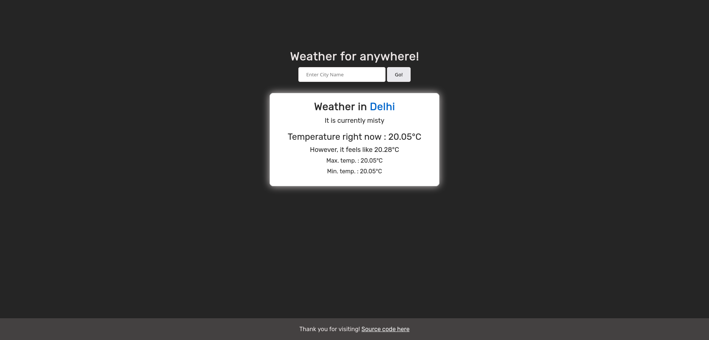

# Blog Website

Hi there! This is a small personal project I did to learn more about fullstack development.

## Table of contents
- [Overview](#overview)
  - [The challenge](#the-challenge)
  - [Screenshots](#screenshots)
  - [Links](#links)
- [My process](#my-process)
  - [Built with](#built-with)
- [Challenges Faced](#challenges-faced)

## Overview

### The challenge

- User should be able to search the weather for any place
- To display various weather metrics

### Screenshots

### Links

- [Solution URL](https://github.com/ChrolloKryber/weatherProject/)
- [Live Site URL](https://weatherproject-production-0d38.up.railway.app/)

## My process

### Built with

- EJS Templating
- Node.js
- CSS Grid
- OpenWeatherMap API
- Express

## Challenges Faced

This was a very fun experience about using APIs and processing data obtained from them.